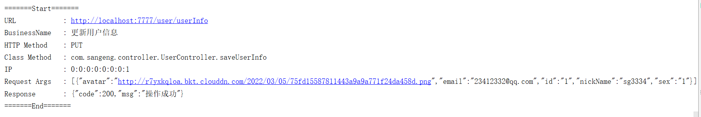

#### 需求

​	需要通过日志记录接口调用信息。便于后期调试排查。并且可能有很多接口都需要进行日志的记录。

​	接口被调用时日志打印格式如下

####  代码实现

日志打印格式

~~~~java
        log.info("=======Start=======");
        // 打印请求 URL
        log.info("URL            : {}",);
        // 打印描述信息
        log.info("BusinessName   : {}", );
        // 打印 Http method
        log.info("HTTP Method    : {}", );
        // 打印调用 controller 的全路径以及执行方法
        log.info("Class Method   : {}.{}", );
        // 打印请求的 IP
        log.info("IP             : {}",);
        // 打印请求入参
        log.info("Request Args   : {}",);
        // 打印出参
        log.info("Response       : {}", );
        // 结束后换行
        log.info("=======End=======" + System.lineSeparator());
~~~~